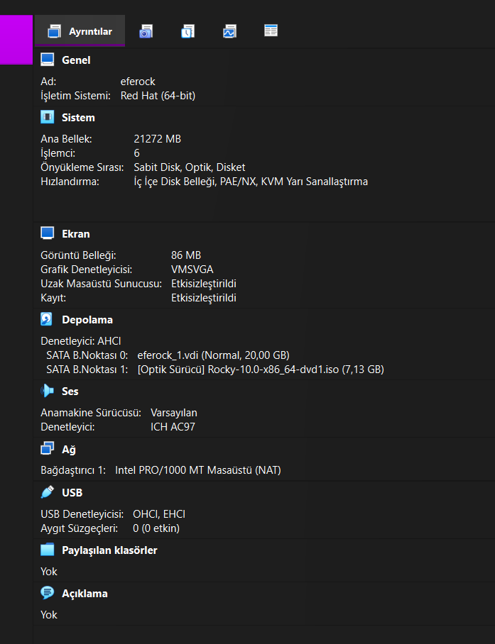
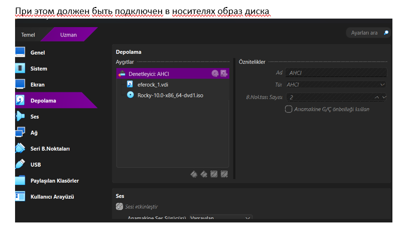
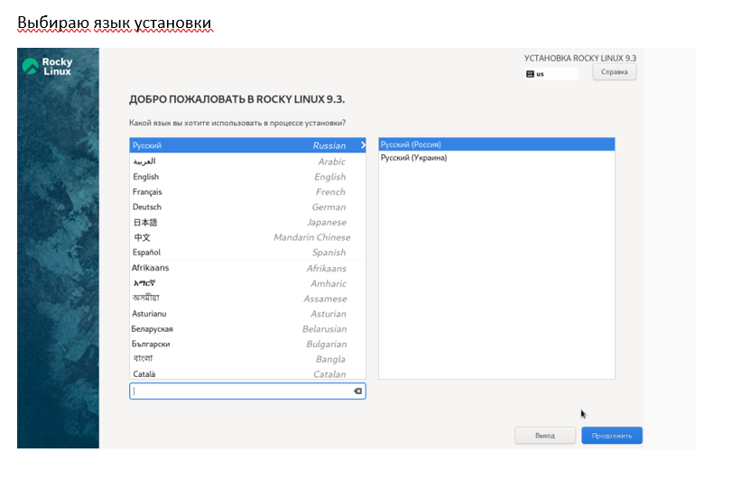
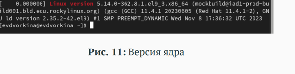
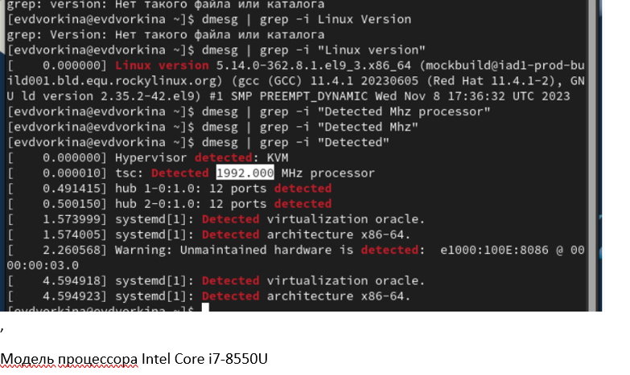
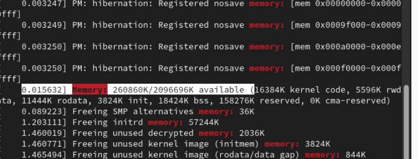
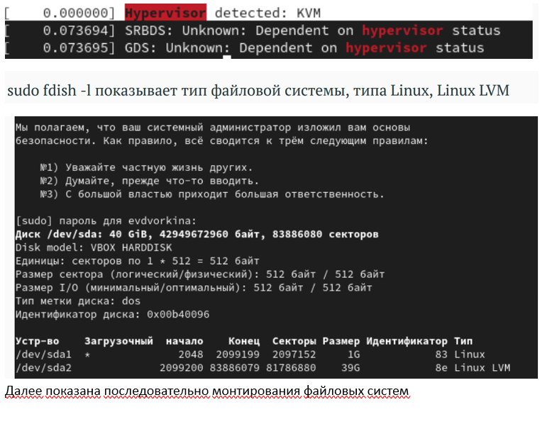
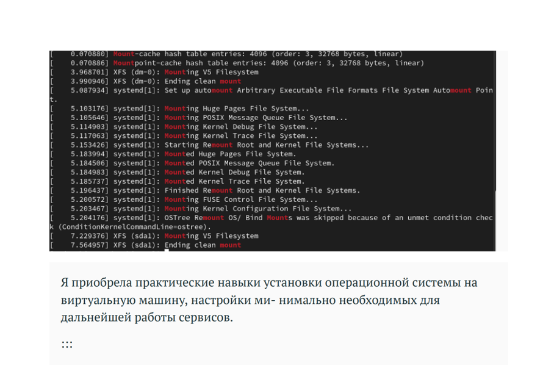

Презентация по лабораторной работе №1 Основы информационной безопасности

•  Mehmet Efe Kantoz

студентка группы НКАбд-01-23 • Российский университет дружбы народов •

Целью данной работы является приобретение практических навыков установки операционной системы на виртуальную машину, настройки минимально необходимых для дальнейшей работы сервисов

Установка и настройка операционной системы

. 2. Найти следующую информацию: 2.1 Версия ядра Linux (Linux version). 2.2 Частота процессора (Detected Mhz processor). 2.3 Модель процессора (CPU0). 2.4 Объем доступной оперативной памяти (Memory available). 2.5 Тип обнаруженного гипервизора (Hypervisor detected). 2.6 Тип файловой системы корневого раздела.

Я выполняю лабораторную работу на домашнем оборудовании, поэтому создаю новую виртуальную машину в VirtualBox, выбира

устанавливать будем операционную систему Rocku DVD

Соглашаюсь с проставленными настройками

Начинается загрузка операционной системы

Открываю терминал, в нем прописываю dmesg | less 

Обнаруженный гипервизор типа KVMv

 

