# Отчет по лабораторной работе №2
**Основы информационной безопасности**

Mehmet Efe Kantoz, НКАбд-01-22

---

## Содержание
1. Цель работы  
2. Задание  
3. Теоретическое введение  
4. Выполнение лабораторной работы  
    - 4.1 Атрибуты файлов  
    - 4.2 Заполнение таблицы 2.1  
    - 4.3 Заполнение таблицы 2.2  
5. Выводы  
6. Список литературы. Библиография

---

## 1. Цель работы
Получение практических навыков работы в консоли с атрибутами файлов, закрепление теоретических основ дискреционного разграничения доступа в современных системах с открытым кодом на базе ОС Linux.

## 2. Задание
- Работа с атрибутами файлов
- Заполнение таблицы «Установленные права и разрешённые действия» (см. табл. 2.1)
- Заполнение таблицы «Минимальные права для совершения операций» (см. табл. 2.2)

## 3. Теоретическое введение
Операционная система — это комплекс программ, предназначенных для управления ресурсами компьютера и организации взаимодействия с пользователем. [1]
Права доступа определяют, какие действия конкретный пользователь может или не может совершать с определенными файлами и каталогами. [2]

## 4. Выполнение лабораторной работы

### 4.1 Атрибуты файлов
## 4. Выполнение лабораторной работы

### 4.1 Атрибуты файлов
В операционной системе Rocky создаю нового пользователя guest через учетную запись администратора (рис. 1).  
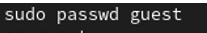

Далее задаю пароль для созданной учетной записи (рис. 2).  
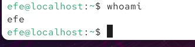

Сменяю пользователя в системе на только что созданного пользователя guest (рис. 3).  
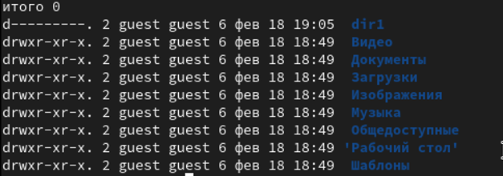

Определяю с помощью команды pwd… (рис. 4).  
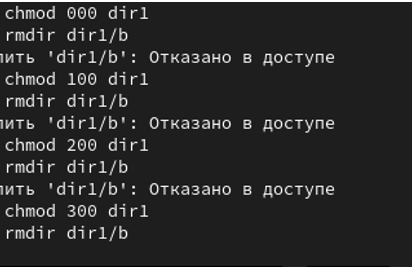

Уточняю имя пользователя (рис. 5).  

… groups и id (рис. 6).  
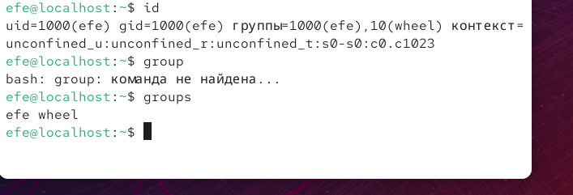

Имя пользователя совпадает (рис. 7).  
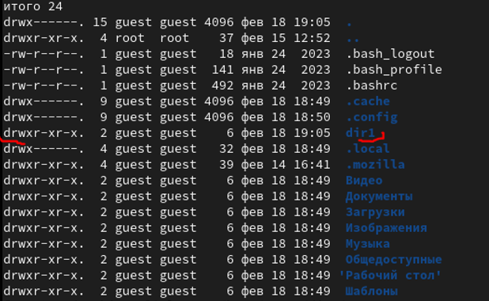

cat /etc/passwd | grep guest (рис. 8).  
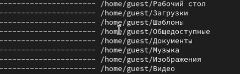

Просмотр содержимого home (рис. 9).  
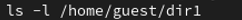

Проверка расширенных атрибутов (рис. 10).  
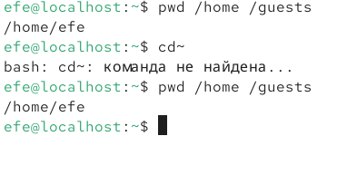

Создание поддиректории dir1 (рис. 11).  
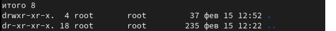

Снятие атрибутов (рис. 12).  
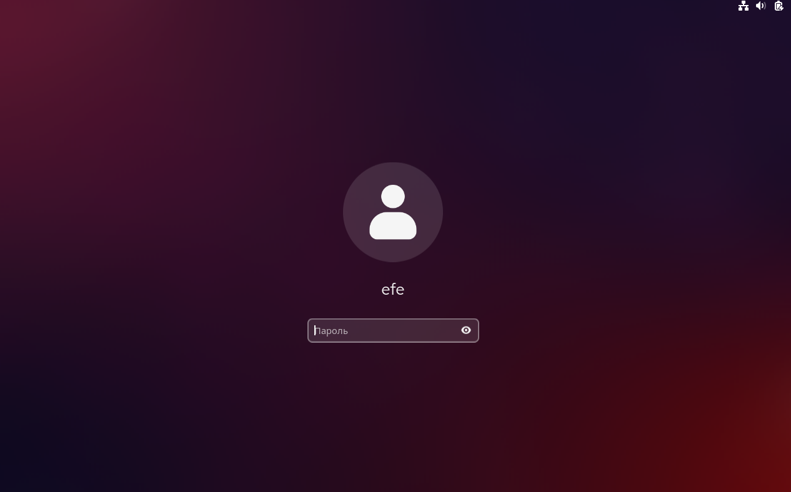

Попытка создания файла (рис. 13).  
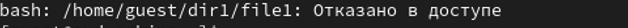

Проверка содержимого директории (рис. 14).  
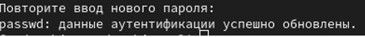

### 4.2 Таблица 2.1  
Таблица 2.1 «Установленные права и разрешённые действия». Пример заполнения (рис. 15).  
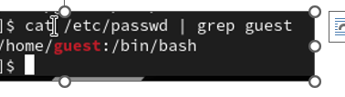

### 4.3 Таблица 2.2  
Пример заполнения таблицы 2.2 (рис. 16).  

### 4.2 Таблица 2.1
*(Таблица прав и разрешённых действий — см. оригинальный документ)*

### 4.3 Таблица 2.2
| Операция              | Минимальные права на директорию | Минимальные права на файл |
|-----------------------|-------------------------------|--------------------------|
| Создание файла        | d(300)                        | -                        |
| Удаление файла        | d(300)                        | -                        |
| Чтение файла          | d(100)                        | (400)                    |
| Запись в файл         | d(100)                        | (200)                    |
| Переименование файла  | d(300)                        | (000)                    |
| Создание поддиректории| d(300)                        | -                        |
| Удаление поддиректории| d(300)                        | -                        |

## 5. Выводы
Были получены практические навыки работы в консоли с атрибутами файлов, закреплены теоретические основы дискреционного разграничения доступа в современных системах с открытым кодом на базе ОС Linux.

## 6. Список литературы
1. [Источник 1]
2. [Источник 2]
