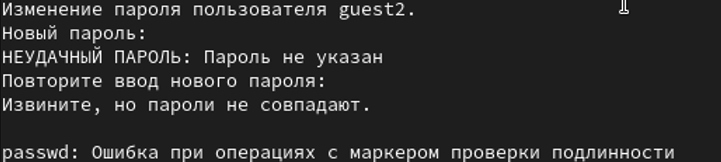
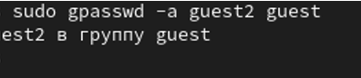
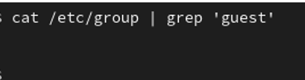
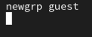
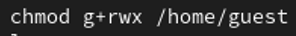
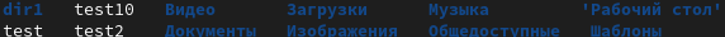

Отчет по лабораторной работе №3

Основы информационной безопасности

Efe kantoz, НКАбд-01-23

1	Цель работы

Получить практические навыки работы в консоли с атрибутами файлов для групп пользователей.

2	Задание

Создание пользователя guest2, добавление его в группу пользователей guest

Заполнение таблицы 3.1

Заполнение таблицы 3.2 на основе таблицы 3.1.

3	Теоретическое введение

Права доступа определяют, какие действия конкретный пользователь может или не может совершать с определенным файлами и каталогами. С помощью разрешений можно создать надежную среду — такую, в которой никто не может поменять содержимое ваших документов или повредить системные файлы. [1]

Группы пользователей Linux кроме стандартных root и users, здесь есть еще пару десятков групп. Это группы, созданные программами, для управления доступом этих программ к общим ресурсам. Каждая группа разрешает чтение или запись определенного файла или каталога системы, тем самым регулируя полномочия пользователя, а следовательно, и процесса, запущенного от этого пользователя. Здесь можно считать, что пользователь - это одно и то же что процесс, потому что у процесса все полномочия пользователя, от которого он запущен. [2]

daemon - от имени этой группы и пользователя daemon запускаютcя сервисы, которым необходима возможность записи файлов на диск.

sys - группа открывает доступ к исходникам ядра и файлам - include сохраненным в системе

sync - позволяет выполнять команду /bin/sync

games - разрешает играм записывать свои файлы настроек и историю в определенную папку

man - позволяет добавлять страницы в директорию /var/cache/man

lp - позволяет использовать устройства параллельных портов

mail - позволяет записывать данные в почтовые ящики /var/mail/

proxy - используется прокси серверами, нет доступа записи файлов на диск

www-data - с этой группой запускается веб-сервер, она дает доступ на запись /var/www, где находятся файлы веб-документов

list - позволяет просматривать сообщения в /var/mail

nogroup - используется для процессов, которые не могут создавать файлов на жестком диске, а только читать, обычно применяется вместе с пользователем nobody.

adm - позволяет читать логи из директории /var/log

tty - все устройства /dev/vca разрешают доступ на чтение и запись пользователям из этой группы

disk - открывает доступ к жестким дискам /dev/sd* /dev/hd*, можно сказать, что это аналог рут доступа.

dialout - полный доступ к серийному порту

cdrom - доступ к CD-ROM

wheel - позволяет запускать утилиту sudo для повышения привилегий

audio - управление аудиодрайвером

src - полный доступ к исходникам в каталоге /usr/src/

shadow - разрешает чтение файла /etc/shadow

utmp - разрешает запись в файлы /var/log/utmp /var/log/wtmp

video - позволяет работать с видеодрайвером

plugdev - позволяет монтировать внешние устройства USB, CD и т д

staff - разрешает запись в папку /usr/local

4	Выполнение лабораторной работы

Пользователь guest был создан в лабораторной работе №2, поэтому в этой лабораторной работе его не создаем заново

Пароль для пользователя guest тоже был задан в лабораторной работе №2.

С правами администратора создаю пользователя guest с помощью команды useradd, далее с помощью команды passwd задаю пароль пользователю (рис. 1).

Создание пользователя

Добавляю пользователя guest2 в группу guest (рис. 2).

Добавление пользователя в группу

Зашла на двух разных консолях от имени двух разных пользователей с помощью команды su <имя пользователя> (рис. 3).

Вход в терминал от имени другого пользователя

Проверяю путь директории, в которой я нахожусь с помощью pwd.

Проверка для пользователя guest (рис. 4).

Текущая директория для guest

Проверка для пользователя guest2 (рис. 5).

Текущая директория для guest2

Стоит отметить, что вход в терминал от имени пользователей был выполнен в домашней директории пользователя evdvorkina, которую команда pwd вывела. Домашней директорией пользователей она не является. Текущая директория с приглашением командной строки совпадает.

Проверяю имя пользователей с поомощью команды whoami, с помощью команды id могу увидеть группы, к которым принадлежит пользователь и коды этих групп (gid), команда groups просто выведет список групп, в которые входит пользователь.

id -Gn - выведет названия групп, которым принадлежит пользователь

id -G - выведет только код групп, которым принадлежит пользователь.

Проверка для пользователя guest2 (рис. 6).

Информация о пользователе guest2

Проверка для пользователя guest (рис. 7).

Информация о пользователе guest

Пользователь guest2 входит в две группы пользователей: в группу guest, потому что я сама его туда добавила, и в группу guest2, которая создалась автоматически при создании пользователя.

Вывела интересующее меня содержимое файла etc/group, видно, что в группе guest два пользователя, а в группе guest2 один (рис. 8).

Содержимое файла etc/group

От имени пользователя guest2 регистрирую его в группе guest с помощью команды newgrp (рис. 9).

Регистрация пользователя в группе

Добавляю права на чтение, запись и исполнение группе пользвателей guest (guest, guest2) на директорию home/guest в которой находятся все файлы для последующей работы (рис. 10).

Изменение прав директории

От имени пользователя guest снимаю все атрибуты с директории dir1, созданной в предыдущей лабораторной работе. Проверяю, что права действительно сняты (рис. 11).

Изменение прав директории

4.1	Заполнение таблицы 3.1

Далее проверяю как пользователь guest2 будет взаимодействовать с файлами в этой директории (рис. 12).

Пример заполнения таблицы 3.1

Таблица 3.1 «Установленные права и разрешённые действия для групп»

4.2	Заполнение таблицы 3.2

На основе таблицы 3.1 заполняю таблицу 3.2.

Таблица 3.2 «Минимальные права для совершения операций от имени пользователей входящих в группу»

5	Выводы

Были получены практические навыки работы в консоли с атрибутами файлов для групп пользователей
