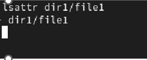
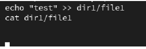
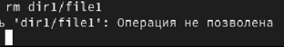
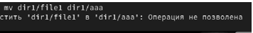
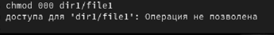
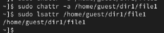
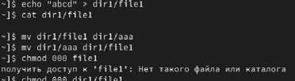
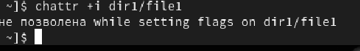
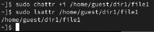

Отчет по лабораторной работе №4

Основы информационной безопасности

Efe kantoz, НКАбд-01-23

1	Цель работы

Получение практических навыков работы в консоли с расширенными атрибутами файлов

2	Теоретическое введение

Права доступа определяют, какие действия конкретный пользователь может или не может совершать с определенным файлами и каталогами. С помощью разрешений можно создать надежную среду — такую, в которой никто не может поменять содержимое ваших документов или повредить системные файлы. [1]

Расширенные атрибуты файлов Linux представляют собой пары имя:значение, которые постоянно связаны с файлами и каталогами, подобно тому как строки окружения связаны с процессом. Атрибут может быть определён или не определён. Если он определён, то его значение может быть или пустым, или не пустым. [2]

Расширенные атрибуты дополняют обычные атрибуты, которые связаны со всеми inode в файловой системе (т. е., данные stat(2)). Часто они используются для предоставления дополнительных возможностей файловой системы, например, дополнительные возможности безопасности, такие как списки контроля доступа (ACL), могут быть реализованы через расширенные атрибуты. [3]

Установить атрибуты:

chattr filename

Значения:

chattr +a # только добавление. Удаление и переименование запрещено;

chattr +A # не фиксировать данные об обращении к файлу

chattr +c # сжатый файл

chattr +d # неархивируемый файл

chattr +i # неизменяемый файл

chattr +S # синхронное обновление

chattr +s # безопасное удаление, (после удаления место на диске переписывается нулями)

chattr +u # неудаляемый файл

chattr -R # рекурсия

Просмотреть атрибуты:

lsattr filename

Опции:

lsattr -R # рекурсия

lsattr -a # вывести все файлы (включая скрытые)

lsattr -d # не выводить содержимое директории

3	Выполнение лабораторной работы

От имени пользователя guest, созданного в прошлых лабораторных работах, определяю расширенные атрибуты файлa /home/guest/dir1/file1 (рис. 1).

Определение атрибутов

Изменяю права доступа для файла home/guest/dir1/file1 с помощью chmod 600 (рис. 2).

Изменение прав доступа

Пробую установить на файл /home/guest/dir1/file1 расширен- ный атрибут a от имени пользователя guest, в ответ получаю отказ от выполнения операции (рис. 3).

Попытка установки рассширенных атрибутов

Устанавливаю расширенные права уже от имени суперпользователя, теперь нет отказа от выполнения операции (рис. 4).

Установка расширенных атрибутов

От пользователя guest проверяю правильность установки атрибута (рис. 5).

Проверка атрибутов

Выполняю дозапись в файл с помощью echo 'test' >> dir1/file1, далее выполняю чтение файла, убеждаюсь, что дозапись была выполнена (рис. 6).

Дозапись в файл

Пробую удалить файл, получаю отказ от выполнения действия. (рис. 7).

Попытка удалить файл

То же самое получаю при попытке переименовать файл(рис. 8).

Попытка переименовать файл

Получаю отказ от выполнения при попытке установить другие права доступа (рис. 9).

Попытка изменить права доступа

Снимаю расширенные атрибуты с файла (рис. 10).

Снятие расширенных атрибутов

Проверяю ранее не удавшиеся действия: чтение, переименование, изменение прав доступа. Теперь все из этого выполняется (рис. 11).

Проверка выполнения действий

Пытаюсь добавить расширенный атрибут i от имени пользователя guest, как и раньше, получаю отказ (рис. 12).

Попытка добавить расширенный атрибут

Добавляю расширенный атрибут i от имени суперпользователя, теперь все выполнено верно (рис. 13).

Добавление расширенного атрибута

Пытаюсь записать в файл, дозаписать, переименовать или удалить, ничего из этого сделать нельзя (рис. 14).

Проверка выполнения действий

4	Выводы

В результате выполнения работы вы повысили свои навыки использования интерфейса командой строки (CLI), познакомились на примерах с тем, как используются основные и расширенные атрибуты при разграничении доступа. Имели возможность связать теорию дискреционного разделения доступа (дискреционная политика безопасности) с её реализацией на практике в ОС Linux. Опробовали действие на практике расширенных атрибутов «а» и «i»

5	Список литературы. Библиография

[0] Методические материалы курса

[1] Права доступа: https://codechick.io/tutorials/unix-linux/unix-linux-permissions

[2] Расширенные атрибуты: https://ru.manpages.org/xattr/7

[3] Операции с расширенными атрибутами: https://p-n-z-8-8.livejournal.com/64493.html
