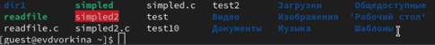
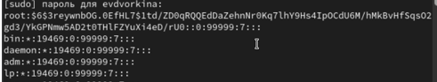
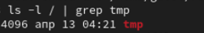

Отчет по лабораторной работе №5

Основы информационной безопасности

Efe kantoz НКАбд-01-23

1	Цель работы

Изучение механизмов изменения идентификаторов, применения SetUID- и Sticky-битов. Получение практических навыков работы в кон- соли с дополнительными атрибутами. Рассмотрение работы механизма смены идентификатора процессов пользователей, а также влияние бита Sticky на запись и удаление файлов.

2	Теоретическое введение

Дополнительные атрибуты файлов Linux

В Linux существует три основных вида прав — право на чтение (read), запись (write) и выполнение (execute), а также три категории пользователей, к которым они могут применяться — владелец файла (user), группа владельца (group) и все остальные (others). Но, кроме прав чтения, выполнения и записи, есть еще три дополнительных атрибута. [1]

Sticky bit

Используется в основном для каталогов, чтобы защитить в них файлы. В такой каталог может писать любой пользователь. Но, из такой директории пользователь может удалить только те файлы, владельцем которых он является. Примером может служить директория /tmp, в которой запись открыта для всех пользователей, но нежелательно удаление чужих файлов.

SUID (Set User ID)

Атрибут исполняемого файла, позволяющий запустить его с правами владельца. В Linux приложение запускается с правами пользователя, запустившего указанное приложение. Это обеспечивает дополнительную безопасность т.к. процесс с правами пользователя не сможет получить доступ к важным системным файлам, которые принадлежат пользователю root.

SGID (Set Group ID)

Аналогичен suid, но относиться к группе. Если установить sgid для каталога, то все файлы созданные в нем, при запуске будут принимать идентификатор группы каталога, а не группы владельца, который создал файл в этом каталоге.

Обозначение атрибутов sticky, suid, sgid

Специальные права используются довольно редко, поэтому при выводе программы ls -l символ, обозначающий указанные атрибуты, закрывает символ стандартных прав доступа.

Пример: rwsrwsrwt

где первая s — это suid, вторая s — это sgid, а последняя t — это sticky bit

В приведенном примере не понятно, rwt — это rw- или rwx? Определить это просто. Если t маленькое, значит x установлен. Если T большое, значит x не установлен. То же самое правило распространяется и на s.

В числовом эквиваленте данные атрибуты определяются первым символом при четырехзначном обозначении (который часто опускается при назначении прав), например в правах 1777 — символ 1 обозначает sticky bit. Остальные атрибуты имеют следующие числовое соответствие:

1 — установлен sticky bit
2 — установлен sgid
4 — установлен suid

Компилятор GCC

GСС - это свободно доступный оптимизирующий компилятор для языков C, C++. Собственно программа gcc это некоторая надстройка над группой компиляторов, которая способна анализировать имена файлов, передаваемые ей в качестве аргументов, и определять, какие действия необходимо выполнить. Файлы с расширением .cc или .C рассматриваются, как файлы на языке C++, файлы с расширением .c как программы на языке C, а файлы c расширением .o считаются объектными [2].

3	Выполнение лабораторной работы

Для лабораторной работы необходимо проверить, установлен ли компилятор gcc, комнда gcc -v позволяет это сделать. Также осуществляется отключение системы запретом с помощью setenforce 0 (рис. 1).

Подготовка к лабораторной работе

Осуществляется вход от имени пользователя guest (рис. 2).

Вход от имени пользователя guest

Создание файла simpled.c и запись в файл кода (рис. 3)

Создание файла

C++ Листинг 1 #include <sys/types.h> #include <unistd.h> #include <stdio.h> int main () { uid_t uid = geteuid (); gid_t gid = getegid (); printf ("uid=%d, gid=%d\n", uid, gid); return 0; }

Cодержимое файла выглядит следующти образом (рис. 4)

Содержимое файла

Компилирую файл, проверяю, что он скомпилировался (рис. 5)

Компиляция файла

Запускаю исполняемый файл. В выводе файла выписыны номера пользоватея и групп, от вывода при вводе if, они отличаются только тем, что информации меньше (рис. 6)

Сравнение команд

Создание, запись в файл и компиляция файла simpled2.c. Запуск программы (рис. 7)

Создание и компиляция файла

C++ Листинг 2 #include <sys/types.h> #include <unistd.h> #include <stdio.h> int main () { uid_t real_uid = getuid (); uid_t e_uid = geteuid (); gid_t real_gid = getgid (); gid_t e_gid = getegid () ; printf ("e_uid=%d, e_gid=%d\n", e_uid, e_gid); printf ("real_uid=%d, real_gid=%d\n", real_uid, real_gid); return 0; }

(рис. 8)

Содержимое файла

С помощью chown изменяю владельца файла на суперпользователя, с помощью chmod изменяю права доступа (рис. 9)

Смена владельца файла и прав доступа к файлу

Сравнение вывода программы и команды id, наша команда снова вывела только ограниченное количество информации(рис. 10)

Запуск файла

Создание и компиляция файла readfile.c (рис. 11)

Создание и компиляция файла

C++ Листинг 3 #include <fcntl.h> #include <stdio.h> #include <sys/stat.h> #include <sys/types.h> #include <unistd.h> int main (int argc, char* argv[]) { unsigned char buffer[16]; size_t bytes_read; int i; int fd = open (argv[1], O_RDONLY); do { bytes_read = read (fd, buffer, sizeof (buffer)); for (i =0; i < bytes_read; ++i) printf("%c", buffer[i]); } while (bytes_read == sizeof (buffer)); close (fd); return 0; }

(рис. 12)

Содержимое файла

Снова от имени суперпользователи меняю владельца файла readfile. Далее меняю права доступа так, чтобы пользователь guest не смог прочесть содержимое файла (рис. 13)

Смена владельца файла и прав доступа к файлу

Проверка прочесть файл от имени пользователя guest.Прочесть файл не удается (рис. 14)

Попытка прочесть содержимое файла

Попытка прочесть тот же файл с помощью программы readfile, в ответ получаем “отказано в доступе” (рис. 15)

Попытка прочесть содержимое файла программой

Попытка прочесть файл \etc\shadow с помощью программы, все еще получаем отказ в доступе (рис. 16)

Попытка прочесть содержимое файла программой

Пробуем прочесть эти же файлы от имени суперпользователя и чтение файлов проходит успешно (рис. 17)

Чтение файла от имени суперпользователя

Проверяем папку tmp на наличие атрибута Sticky, т.к. в выводе есть буква t, то атрибут установлен (рис. 18)

Проверка атрибутов директории tmp

От имени пользователя guest создаю файл с текстом, добавляю права на чтение и запись для других пользователей (рис. 19)

Создание файла, изменение прав доступа

Вхожу в систему от имени пользователя guest2, от его имени могу прочитать файл file01.txt, но перезаписать информацию в нем не могу (рис. 20)

Попытка чтения файла

Также невозможно добавить в файл file01.txt новую информацию от имени пользователя guest2 (рис. 21)

Попытка записи в файл

Далее пробуем удалить файл, снова получаем отказ (рис. 22)

Попытка удалить файл

От имени суперпользователя снимаем с директории атрибут Sticky (рис. 23)

Смена атрибутов файла

Проверяем, что атрибут действительно снят (рис. 24)

Проверка атрибутов директории

Далее был выполнен повтор предыдущих действий. По результатам без Sticky-бита запись в файл и дозапись в файл осталась невозможной, зато удаление файла прошло успешно (рис. 25)

Повтор предыдущих действий

Возвращение директории tmp атрибута t от имени суперпользователя (рис. 26)

Изменение атрибутов

4	Выводы

Изучила механизм изменения идентификаторов, применила SetUID- и Sticky-биты. Получила практические навыки работы в кон- соли с дополнительными атрибутами. Рассмотрела работы механизма смены идентификатора процессов пользователей, а также влияние бита Sticky на запись и удаление файлов.

Список литературы

1. 	Дополнительные атрибуты файлов: sticky bit, suid, sgid [Электронный ресурс]. 2018. URL: .

2. 	Инструментарий программиста в Linux: Компилятор GCC [Электронный ресурс]. URL: .
