Отчет по лабораторной работе №6

Основы информационной безопасности

Efe kantoz, НКАбд-01-23

1	Цель работы

Развить навыки администрирования ОС Linux. Получить первое практическое знакомство с технологией SELinux1. Проверить работу SELinx на практике совместно с веб-сервером Apache. [1]

2	Теоретическое введение

SELinux (Security-Enhanced Linux) обеспечивает усиление защиты путем внесения изменений как на уровне ядра, так и на уровне пространства пользователя, что превращает ее в действительно «непробиваемую» операционную систему. Впервые эта система появилась в четвертой версии CentOS, а в 5 и 6 версии реализация была существенно дополнена и улучшена.

SELinux имеет три основных режим работы:

Enforcing: режим по умолчанию. При выборе этого режима все действия, которые каким-то образом нарушают текущую политику безопасности, будут блокироваться, а попытка нарушения будет зафиксирована в журнале.

Permissive: в случае использования этого режима, информация о всех действиях, которые нарушают текущую политику безопасности, будут зафиксированы в журнале, но сами действия не будут заблокированы.

Disabled: полное отключение системы принудительного контроля доступа.

Политика SELinux определяет доступ пользователей к ролям, доступ ролей к доменам и доступ доменов к типам. Контекст безопасности — все атрибуты SELinux — роли, типы и домены. Более подробно см. в [2].

Apache — это свободное программное обеспечение, с помощью которого можно создать веб-сервер. Данный продукт возник как доработанная версия другого HTTP-клиента от национального центра суперкомпьютерных приложений (NCSA).

Для чего нужен Apache сервер:

чтобы открывать динамические PHP-страницы,

для распределения поступающей на сервер нагрузки,

для обеспечения отказоустойчивости сервера,

чтобы потренироваться в настройке сервера и запуске PHP-скриптов.

Apache является кроссплатформенным ПО и поддерживает такие операционные системы, как Linux, BSD, MacOS, Microsoft, BeOS и другие.

Более подробно см. в [3].

3	Выполнение лабораторной работы

Вошла в систему под своей учетной записью. Убедилась, что SELinux работает в режиме enforcing политики targeted с помощью команд getenforce и sestatus (рис. 1).

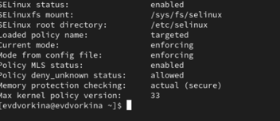

Рис. 1: проверка режима работы SELinux

Запускаю сервер apache, далее обращаюсь с помощью браузера к веб-серверу, запущенному на компьютере, он работает, что видно из вывода команды service httpd status (рис. 2).

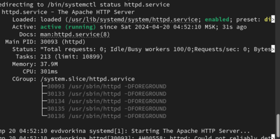

Рис. 2: Проверка работы Apache

С помощью команды ps auxZ | grep httpd нашла веб-сервер Apache в списке процессов. Его контекст безопасности - httpd_t (рис. 3).

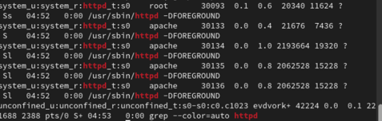

Рис. 3: Контекст безопасности Apache

Просмотрела текущее состояние переключателей SELinux для Apache с помощью команды sestatus -bigrep httpd (рис. 4).

Рис. 4: Состояние переключателей SELinux

Просмотрела статистику по политике с помощью команды seinfo. Множество пользователей - 8, ролей - 39, типов - 5135. (рис. 5).

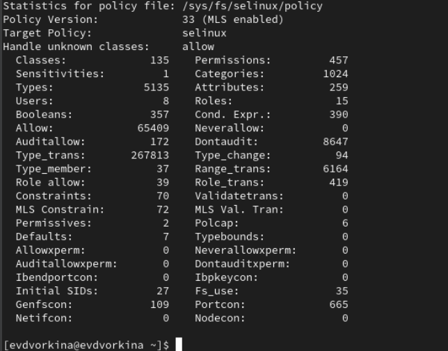

Рис. 5: Cтатистика по политике

Типы поддиректорий, находящихся в директории /var/www, с помощью команды ls -lZ /var/www следующие: владелец - root, права на изменения только у владельца. Файлов в директории нет (рис. 6).

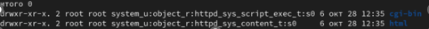

Рис. 6: Типы поддиректорий

В директории /var/www/html нет файлов. (рис. 7).

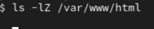

Рис. 7: Типы файлов

Создать файл может только суперпользователь, поэтому от его имени создаем файл touch.html cо следующим содержанием:

<html>
<body>test</body>
</html>

(рис. 8).

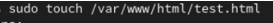

Рис. 8: Создание файла

Проверяю контекст созданного файла. По умолчанию это httpd_sys_content_t (рис. 9).

Рис. 9: Контекст файла

Обращаюсь к файлу через веб-сервер, введя в браузере адрес http://127.0.0.1/test.html. Файл был успешно отображён (рис. 10).

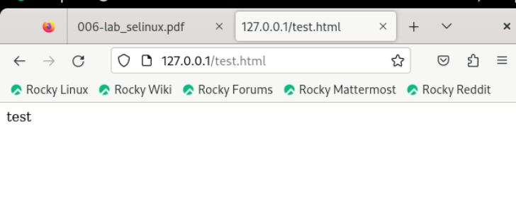

Рис. 10: Отображение файла

Изучила справку man httpd_selinux. Рассмотрим полученный контекст детально. Так как по умолчанию пользователи CentOS являются свободными от типа (unconfined в переводе с англ. означает свободный), созданному нами файлу test.html был сопоставлен SELinux, пользователь unconfined_u. Это первая часть контекста. Далее политика ролевого разделения доступа RBAC используется процессами, но не файлами, поэтому роли не имеют никакого значения для файлов. Роль object_r используется по умолчанию для файлов на «постоянных» носителях и на сетевых файловых системах. (В директории /ргос файлы, относящиеся к процессам, могут иметь роль system_r. Если активна политика MLS, то могут использоваться и другие роли, например, secadm_r. Данный случай мы рассматривать не будем, как и предназначение :s0). Тип httpd_sys_content_t позволяет процессу httpd получить доступ к файлу. Благодаря наличию последнего типа мы получили доступ к файлу при обращении к нему через браузер. (рис. 11).

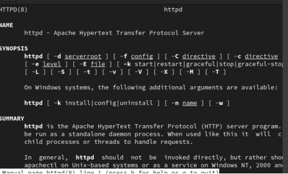

Рис. 11: Изучение справки по команде

Изменяю контекст файла /var/www/html/test.html с httpd_sys_content_t на любой другой, к которому процесс httpd не должен иметь доступа, например, на samba_share_t: chcon -t samba_share_t /var/www/html/test.html ls -Z /var/www/html/test.html Контекст действительно поменялся (рис. 12).

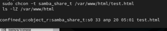

Рис. 12: Изменение контекста

При попытке отображения файла в браузере получаем сообщение об ошибке (рис. 13).

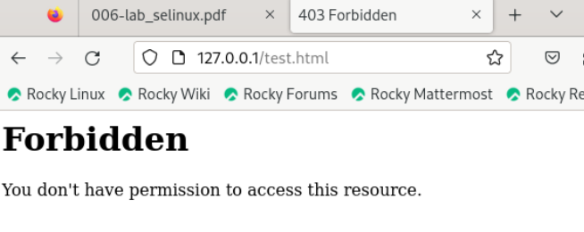

Рис. 13: Отображение файла

файл не был отображён, хотя права доступа позволяют читать этот файл любому пользователю, потому что установлен контекст, к которому процесс httpd не должен иметь доступа.

Просматриваю log-файлы веб-сервера Apache и системный лог-файл: tail /var/log/messages. Если в системе окажутся запущенными процессы setroubleshootd и audtd, то вы также сможете увидеть ошибки, аналогичные указанным выше, в файле /var/log/audit/audit.log. (рис. 14).

Рис. 14: Попытка прочесть лог-файл

Чтобы запустить веб-сервер Apache на прослушивание ТСР-порта 81 (а не 80, как рекомендует IANA и прописано в /etc/services) открываю файл /etc/httpd/httpd.conf для изменения. (рис. 15).

Рис. 15: Изменение файла

Нахожу строчку Listen 80 и заменяю её на Listen 81. (рис. 16).

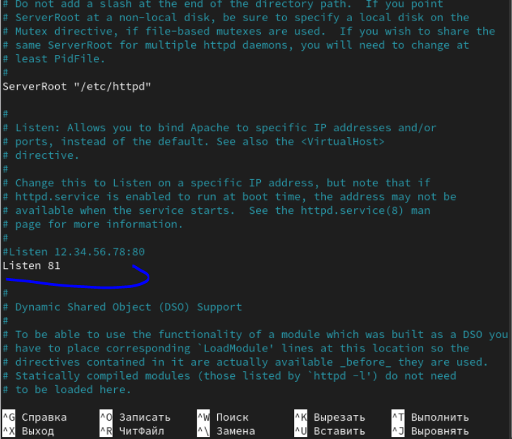

Рис. 16: Изменение порта

Выполняю перезапуск веб-сервера Apache. Произошёл сбой, потому что порт 80 для локальной сети, а 81 нет (рис. 17).

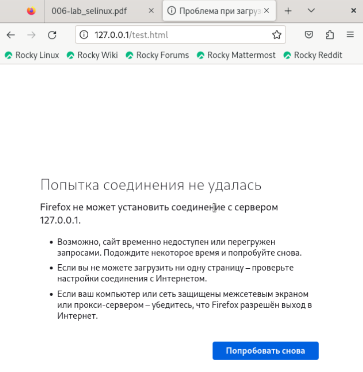

Рис. 17: Попытка прослушивания другого порта

Проанализируйте лог-файлы: tail -nl /var/log/messages (рис. 18).

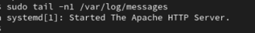

Рис. 18: Проверка лог-файлов

Просмотрите файлы /var/log/http/error_log, /var/log/http/access_log и /var/log/audit/audit.log и выясните, в каких файлах появились записи. Запись появилась в файлу error_log (рис. 19).

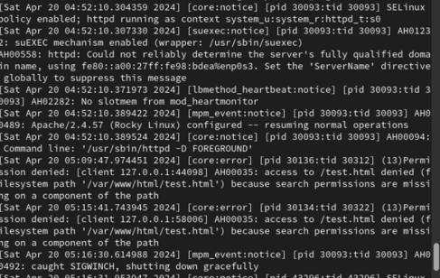

Рис. 19: Проверка лог-файлов

Выполняю команду semanage port -a -t http_port_t -р tcp 81 После этого проверяю список портов командой semanage port -l | grep http_port_t Порт 81 появился в списке (рис. 20).

Рис. 20: Проверка портов

Перезапускаю сервер Apache (рис. 21).

Рис. 21: Перезапуск сервера

Теперь он работает, ведь мы внесли порт 81 в список портов htttpd_port_t (рис. 22).

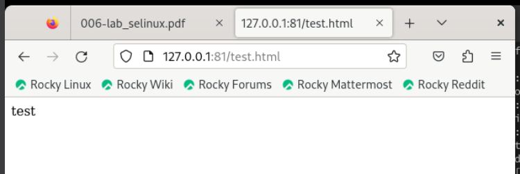

Рис. 22: Проверка сервера

Возвращаю в файле /etc/httpd/httpd.conf порт 80, вместо 81. Проверяю, что порт 81 удален, это правда. (рис. 23).

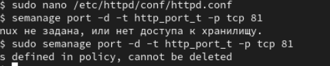

Рис. 23: Проверка порта 81

Далее удаляю файл test.html, проверяю, что он удален(рис. 24).

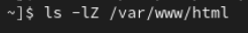

Рис. 24: Удаление файла

4	Выводы

В ходе выполнения данной лабораторной работы были развиты навыки администрирования ОС Linux, получено первое практическое знакомство с технологией SELinux и проверена работа SELinux на практике совместно с веб-сервером Apache.
